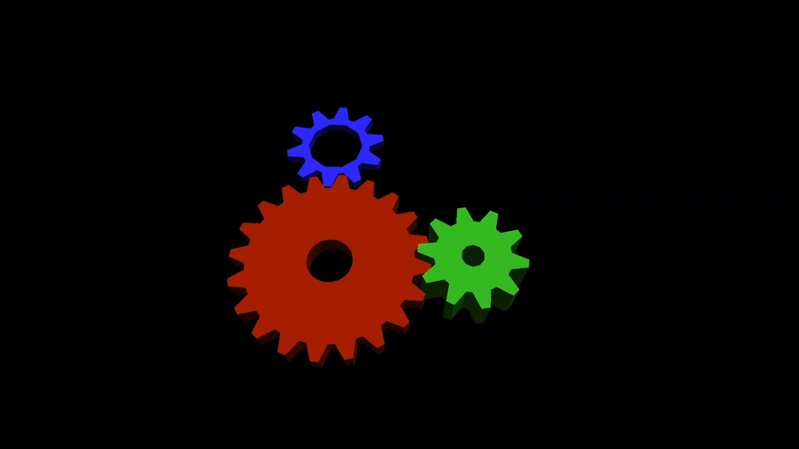

# PS5 AGC Gears

**AGC Gears is a hardware-accelerated graphics demo for native
PlayStation 5 homebrew.** It drives the **PS5 GPU** through AGC, the console's
low-level graphics interface, using independently authored `gfx1013` shaders.

<p align="center">
  
</p>

<p align="center"><em>Direct Remote Play capture from AGC Gears running on real PS5 hardware (FW 12.02).</em></p>

The project follows the tradition of Mesa's
[`glxgears`](https://gitlab.freedesktop.org/mesa/demos/-/blob/main/src/xdemos/glxgears.c)
and
[`es2gears`](https://gitlab.freedesktop.org/mesa/demos/-/blob/main/src/egl/opengles2/es2gears.c):
the familiar rotating gears used for decades as a quick visual sanity check that
a Linux/OpenGL graphics path is alive. Like those demos, AGC Gears is **not a
GPU benchmark**. Here the same recognizable scene makes native PS5 GPU progress
visible and reproducible.

## What works

| Capability | Hardware result |
| --- | --- |
| GPU and shaders | AGC pipeline with independently authored `gfx1013` shaders |
| Scene | Three lit, animated 3D gears derived from Mesa's MIT-licensed geometry |
| Rendering | Depth-tested geometry plus a shader-based render-target clear |
| Scheduling | Two frames genuinely in flight |
| Completion | GPU fence and exact VideoOut flip-event ownership |
| Runtime | Continuous until the user selects **Close Game** |
| Observability | Structured TCP telemetry, heartbeats and immutable run manifests |

The strongest finite reference is the complete Phase 3 texture path running
uninterrupted for 60,000 frames on one PS5 with firmware 12.02. It completed
with deterministic mip chains, bounded dynamic-lightmap uploads, separate
opaque/alpha-test/sky passes, exact residency/upload accounting, zero renderer
errors and a clean teardown. The Phase 2 resource-foundation build separately
passed 60,000 frames with exact transient retirement, all four persistent
allocations reclaimed and its animated overlay confirmed in Remote Play.
Continuous-mode hardware runs reached 25,560 completed frames before operator
closure. See
[`docs/HARDWARE_VALIDATION.md`](docs/HARDWARE_VALIDATION.md) for the precise
evidence boundary.

## Build and test

Run all host contracts and the fail-closed publication audit:

```sh
make test
make audit
```

Compile the public shader source with an LLPC build that supports GFX1013:

```sh
make shaders AMDLLPC=/path/to/amdllpc LLVM_READELF=/path/to/llvm-readelf
```

The validated compiler is the public
[`mpereiraesaa/llpc` GFX1013 commit](https://github.com/mpereiraesaa/llpc/commit/23a0757d922da7eb06c6a626d48553e0fb99fde0),
built against the pinned
[`GPUOpen-Drivers/llvm-project` commit](https://github.com/GPUOpen-Drivers/llvm-project/commit/8fd93e26cf9b1235fc9573b68b96233818be0ed4).
The LLPC fork includes a regression that compiles a shader with
`-gfxip=10.1.3`.

Build the ignored native title directory:

```sh
PS5LOG_DEV_CONF=/absolute/private/dev.conf make native \
  AMDLLPC=/path/to/amdllpc LLVM_READELF=/path/to/llvm-readelf
```

The build pins and verifies its public native foundation, always targets
`-gfxip=10.1.3`, derives shader metadata from PAL notes, links/signs the native
executable and packages `dist/PPSA99997/`. Generated binaries, local telemetry
configuration and deployment material are excluded from publication. Deployment
remains loader-specific.

## Design and scope

The implementation covers native initialization, direct memory, color/depth
surfaces, shader metadata, command composition, submission, synchronization,
VideoOut presentation and teardown. Its capability path was deliberately small:

```text
Triangle -> Plasma -> Cube -> Gears
```

This repository contains no proprietary Sony SDK files, game material, dumps,
shaders or command buffers, and no jailbreak or payload-delivery implementation.
Hardware results apply only to the console and firmware actually tested.

Useful references:

- [`docs/ARCHITECTURE.md`](docs/ARCHITECTURE.md) — renderer structure
- [`docs/BACKEND_PROVENANCE.md`](docs/BACKEND_PROVENANCE.md) — source provenance boundary
- [`docs/HARDWARE_VALIDATION.md`](docs/HARDWARE_VALIDATION.md) — hardware evidence
- [`docs/BSP_RESOURCE_FOUNDATION_PHASE2.md`](docs/BSP_RESOURCE_FOUNDATION_PHASE2.md) — fence-retired resources and transient rendering
- [`docs/TELEMETRY.md`](docs/TELEMETRY.md) — runtime observability contract
- [`docs/DEVELOPMENT.md`](docs/DEVELOPMENT.md) — development workflow
- [`docs/RELEASING.md`](docs/RELEASING.md) — reproducible releases

## Credits and license

The native shell derives from
[BlackBearReloaded's PS5 Native App Boilerplate](https://github.com/blackbearreloaded/ps5-native-app-boilerplate).
The gear geometry adapts Mesa's MIT-licensed `es2gears`; exact provenance and
attribution are recorded in [`NOTICE.md`](NOTICE.md). All shaders and AGC
integration in this repository are independently authored and source
reproducible.

Licensed GPL-3.0-or-later. The application identity `PPSA99997` is a local
development identifier, not an official Sony assignment.
